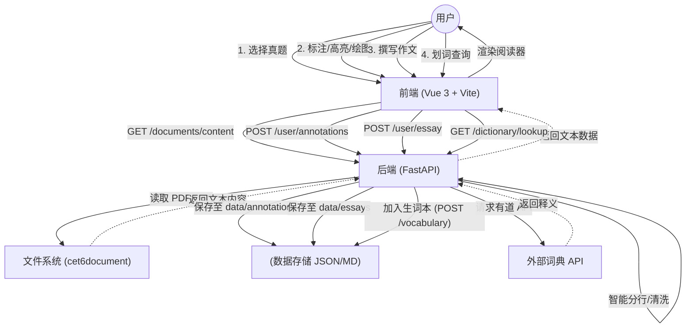

# CET6 Web Learning Platform (cet6web)

**CET6 Web** 是一个专注于英语六级（CET6）备考的交互式学习平台。它集成了真题阅读、智能词汇管理、文档标注（高亮、绘图）以及写作练习功能，旨在为考生提供高效、沉浸式的学习体验。

## 1. 项目介绍

本项目采用前后端分离架构，旨在解决传统纸质或静态PDF备考的痛点，提供以下核心价值：
- **真题阅览**：自动解析历年真题PDF，提供清爽的文本阅读体验，支持智能分行优化阅读。
- **文档标注**：支持在真题上进行高亮、手写绘图，所有标注自动持久化保存。
- **生词本**：阅读时可即时查词并加入生词本，系统自动获取释义（基于有道建议API）。
- **写作/笔记**：针对每套真题提供独立的 Markdown 写作区域，方便撰写作文或笔记。

## 2. 环境配置与启动

### 前提条件
- **Python**: 3.8+
- **Node.js**: 16+

### 2.1 后端配置 (Backend)
后端使用 Python FastAPI 框架。

1. 进入后端目录：
   ```bash
   cd backend
   ```
2. 安装依赖：
   ```bash
   pip install -r requirements.txt
   ```
3. 启动服务：
   ```bash
   python main.py
   # 或者使用 uvicorn 直接启动
   # uvicorn main:app --reload --host 0.0.0.0 --port 8000
   ```
   服务将默认运行在 `http://localhost:8000`。

### 2.2 前端配置 (Frontend)
前端使用 Vue 3 + Vite。

1. 进入前端目录：
   ```bash
   cd frontend
   ```
2. 安装依赖：
   ```bash
   npm install
   ```
3. 启动开发服务器：
   ```bash
   npm run dev
   ```
   访问控制台输出的本地地址（通常为 `http://localhost:5173`）即可使用。

## 3. 项目 API 介绍

后端提供了一系列 RESTful API 用于数据交互。详细文档请参考 `backend_api.md`。

### 文档管理
- **获取真题列表**: `GET /api/v1/documents/list`
  - 返回按年份、月份分组的真题文件树。
- **获取真题内容**: `GET /api/v1/documents/content`
  - 参数: `doc_id` (文件相对路径)
  - 返回: 解析后的文本行列表。

### 用户数据 (持久化)
- **标注 (Annotations)**
  - 获取: `GET /api/v1/user/annotations`
  - 保存: `POST /api/v1/user/annotations`
  - 功能: 存储用户在 Canvas 上的绘图数据。
- **作文/笔记 (Essays)**
  - 获取: `GET /api/v1/user/essay`
  - 保存: `POST /api/v1/user/essay`
  - 功能: 存储针对该文档的 Markdown 内容。

### 词汇辅助
- **生词本**:
  - 获取列表: `GET /api/v1/vocabulary`
  - 添加生词: `POST /api/v1/vocabulary` (自动查询释义)
  - 删除生词: `DELETE /api/v1/vocabulary/{entry_id}`
- **查词**: `GET /api/v1/dictionary/lookup` (代理外部词典 API)

## 4. 系统流程图

以下展示了用户与系统的核心交互流程：



## 5. 项目结构概览

```
cet6web/
├── backend/                # 后端代码
│   ├── main.py             # 启动入口 & API 定义
│   ├── data/               # 用户数据 (此目录被 git忽略或作为持久化卷)
│   │   ├── annotations/    # 标注数据
│   │   └── essays/         # 作文数据
│   └── vocabulary.json     # 生词本数据
├── frontend/               # 前端代码
│   ├── src/
│   │   ├── components/     # Vue 组件 (DocumentViewer, WordBook 等)
│   │   └── App.vue         # 主应用入口
├── cet6document/           # 资源文件 (真题 PDF/LRC)
└── README.md               # 项目说明 (本文档)
```
